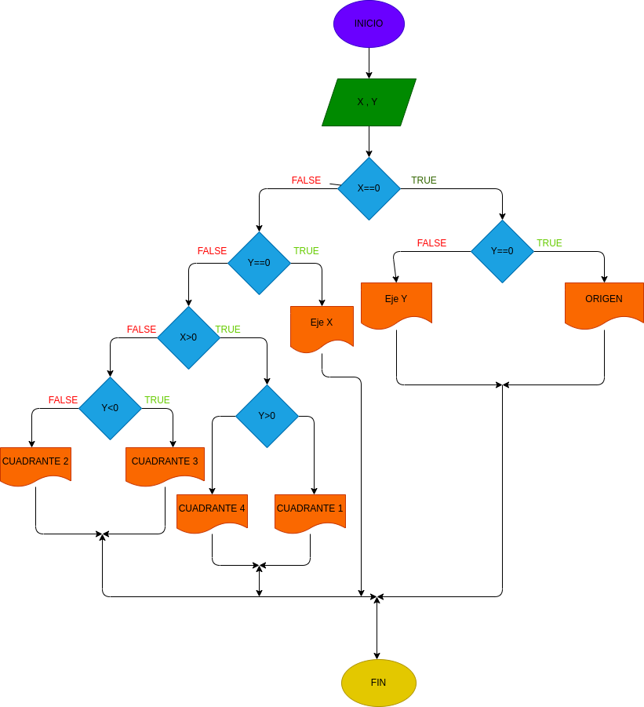

# ejercicio 1 taller condicional

## planos cartesianos (X , Y)

# ANALISIS

variable de entrada(input)

X=un punto en el plano

y=un punto en el plano

variables de proceso y salida(processing, storage, output)

rta=nos dice si esta en el origen

rta=nos dice en que eje se encuentra en el plano

eje X

eje Y

rta=nos dice en que cuadrante se encuentra el punto

# DISEÑO

# CONSTRUCCION
