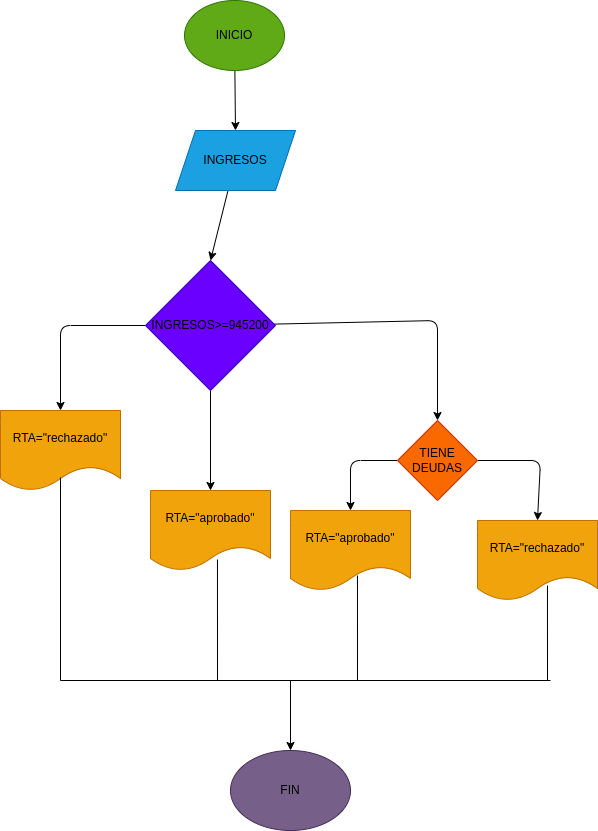

# ejercicio 2 taller condicional

## prestamo bancario

# ANALISIS

variable de entrada(input)

ingresos del cliente

tiene deudas

variables de proceso y salida(processing, storage, output)

rta=aceptado el prestamo

rta=rechazado el prestamo

rta=rechazado el prestamo por que tiene deudas

# DISEÑO

