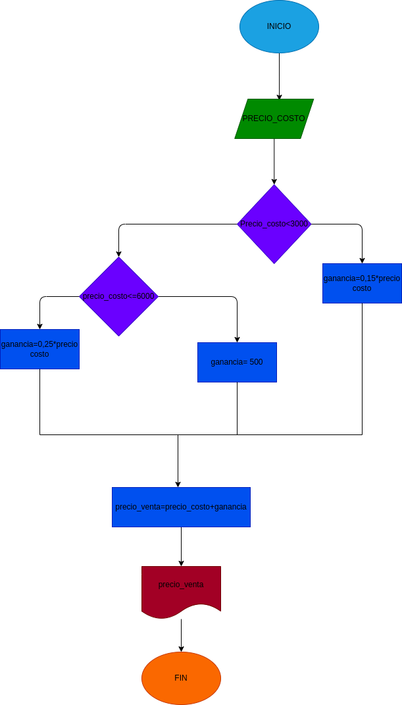

# ejercicio 3 taller condicional

## precio de venta

# ANALISIS

variable de entrada(input)

precio_costo= precio en el que compra el producto

variables de proceso y salida(processing, storage, output)

precio_venta=precio en el que vende el producto

ganancia=porcentage de rentabilidad del producto

precio_venta=precio_costo + ganancia

# DISEÑO

# CONSTUCCION